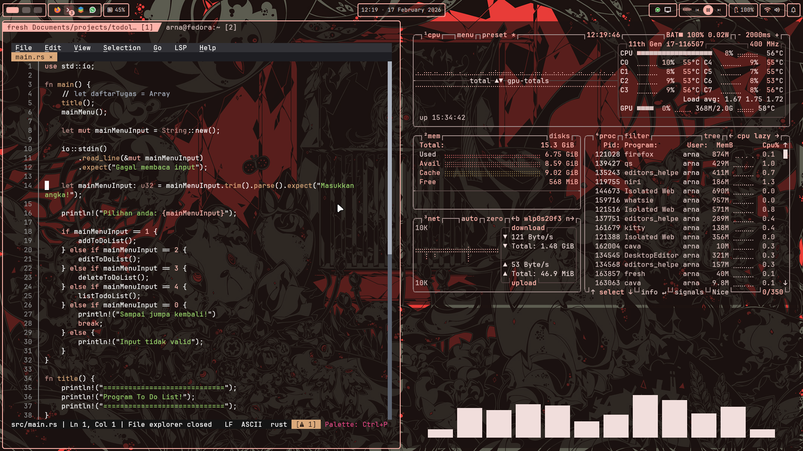
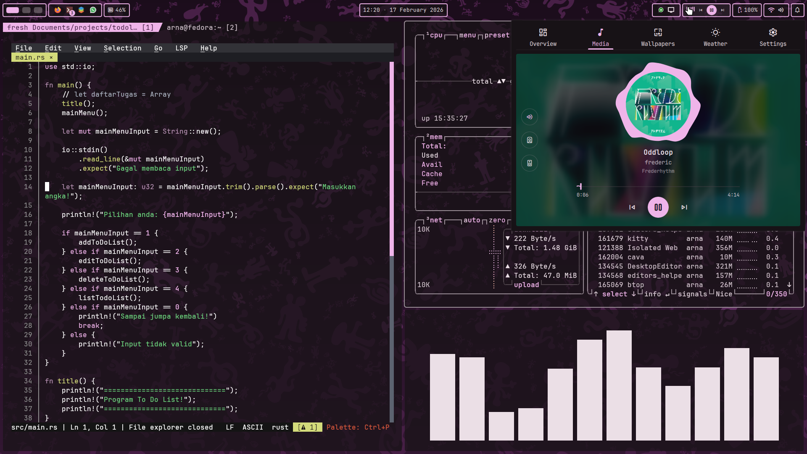
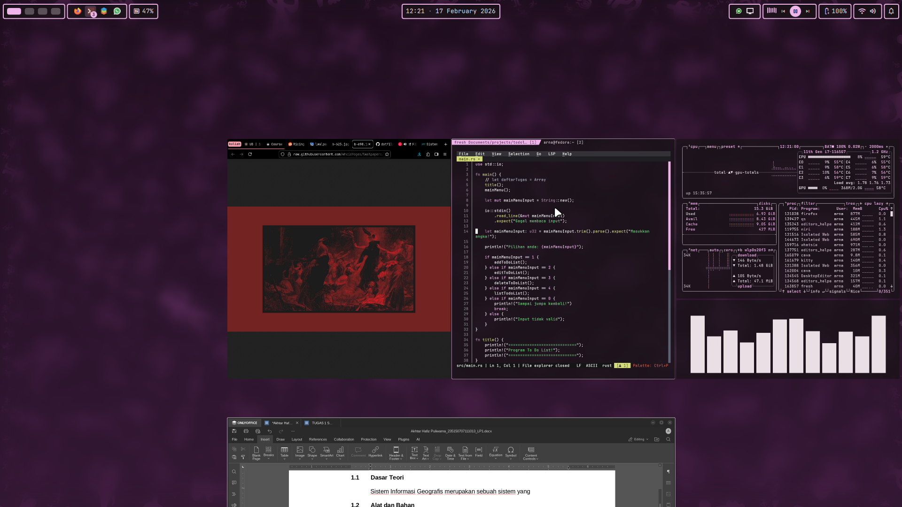

# niri-dots
Dotfiles baru buat laptop utama.
Ini setup Niri + Dank Material Shell yang baru aja aku coba.
Skema warna sistem berubah sesuai wallpaper yang digunakan menggunakan matugen.

## Galeri

<!---->

<!---->

<!---->







## Instalasi

Sebelum pake dotfile ini, install dulu beberapa dependensi berikut

```sh
sudo dnf install niri quickshell
```

Setelah itu baru install Dank Material Shell nya pake skrip berikut:
[dankinstall](https://danklinux.com/docs/dankinstall)
```sh
# Sebenernya kalau mau langsung kesini juga gapapa. Sudah ada installernya gitu
curl -fsSL https://install.danklinux.com | sh
```

Kalau udah di install, tinggal copy aja file ini ke folder .config

```sh
git clone https://github.com/bukanberuangsr/niri-dots.git

# misalnya mau ganti konfigurasi Kitty:
cp -r path/to/niri-dots/kitty ~/.config/kitty;
```

# TODO

- [ ] push config yg perlu
- [ ] buat script install (?)


## Credits

- [Matugen themes](github.com/corecathx/matugen-themes-zed/)
- [Niri](https://github.com/YaLTeR/niri)
- [Quickshell](https://quickshell.org/)
- [DankMaterialShell](https://danklinux.com/)
