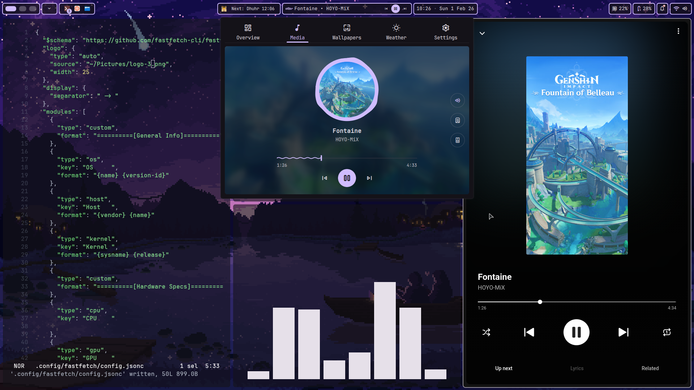
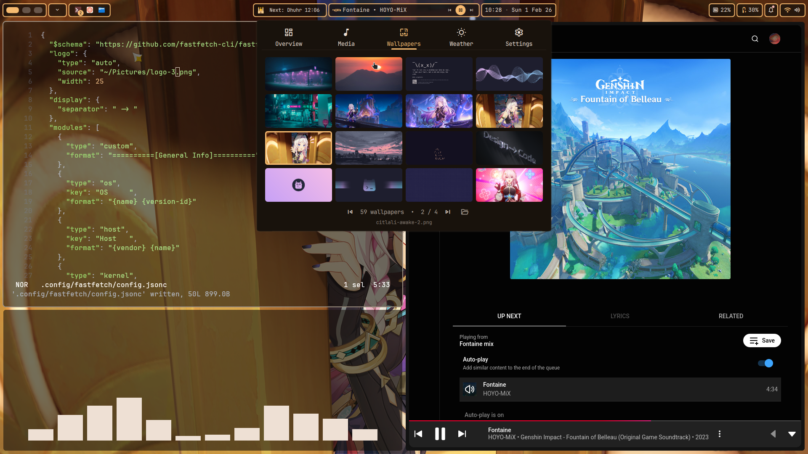
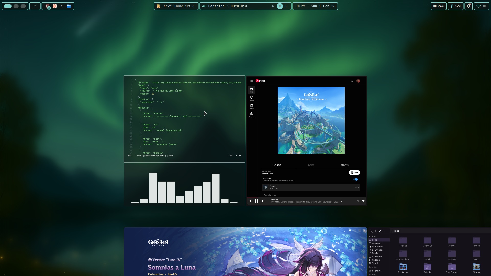

# niri-dots
Dotfiles baru buat laptop utama. Ini setup Niri + DankMaterial Shell yang baru aja aku coba. Skema warnanya ganti-ganti sesuai wallpaper yang digunakan. Kedepannya mungkin ada perubahan. Untuk filenya sendiri... hehe... nanti yah rek.

## Galeri






## Komponen

Beberapa komponen utama desktop ini itu diantaranya:
1. [Niri Wayland Compositor](https://github.com/YaLTeR/niri)
2. [Quickshell](https://quickshell.org/) (spesifiknya pake [DankMaterialShell](https://danklinux.com/))

## Instalasi

Sebelum pake dotfile ini, install dulu beberapa dependensi berikut

```sh
sudo dnf install niri quickshell
```

Setelah itu baru install Dank Material Shell nya pake skrip yang udah dibuat. (dokumentasi dankinstall bisa dilihat pada link berikut: [dankinstall](https://danklinux.com/docs/dankinstall))
```sh
# Sebenernya kalau mau langsung kesini juga gapapa. Sudah ada installernya gitu
curl -fsSL https://install.danklinux.com | sh
```

Kalau udah di install, tinggal copy aja file ini ke folder .config (nanti bakal aku coba buat scriptnya, tapi sebelum itu pake ini aja)

```sh
git clone https://github.com/bukanberuangsr/niri-dots.git
# contoh aja ya, misalnya mau ganti konfigurasi Kitty:
cp -r path/to/niri-dots/kitty ~/.config/kitty;
```

## Credits

Makasih untuk [Matugen themes](github.com/corecathx/matugen-themes-zed/) buat tema aplikasi-aplikasi lain agar dapat beradaptasi dengan tema matugen bawaan sistem.
